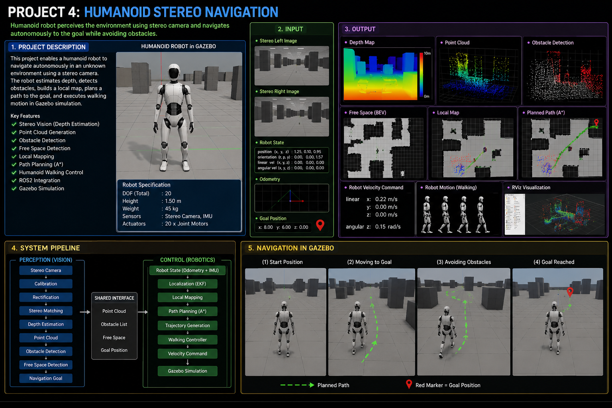

# Project — Humanoid Stereo Navigation

---

# Overview

Humanoid Stereo Navigation is a robotics project that enables a humanoid robot to
perceive its surrounding environment using a stereo camera system and navigate
autonomously toward a target while avoiding obstacles.

This project is the first integration between **Robot Perception** and
**Robot Control**, combining Computer Vision, Depth Estimation, Navigation,
Motion Planning, and Robot Simulation into a complete robotics pipeline.

The robot estimates scene depth from stereo images, reconstructs the
three-dimensional environment, detects obstacles, identifies traversable areas,
plans a collision-free path, and executes movement commands inside a simulated
environment.

Unlike previous projects that focused only on perception, this project transforms
visual information into real robot motion, serving as the bridge between
"seeing" and "acting".

<p align="center">
    
</p>

---

# Project Goal

Build a complete humanoid navigation system capable of

• Perceiving the environment using Stereo Vision

• Estimating depth information

• Generating Point Clouds

• Detecting obstacles

• Identifying free navigation space

• Planning collision-free paths

• Controlling humanoid movement

• Navigating safely inside Gazebo simulation

---

# System Workflow

```text
                    ┌──────────────────────┐
                    │   Stereo Camera      │
                    └──────────┬───────────┘
                               │
                               ▼
                  ┌──────────────────────────┐
                  │ Camera Calibration       │
                  └──────────┬───────────────┘
                             │
                             ▼
                  ┌──────────────────────────┐
                  │ Stereo Rectification     │
                  └──────────┬───────────────┘
                             │
                             ▼
                  ┌──────────────────────────┐
                  │ Depth Estimation         │
                  └──────────┬───────────────┘
                             │
                             ▼
                  ┌──────────────────────────┐
                  │ Point Cloud Generation   │
                  └──────────┬───────────────┘
                             │
                             ▼
                  ┌──────────────────────────┐
                  │ Obstacle Detection       │
                  └──────────┬───────────────┘
                             │
                             ▼
                  ┌──────────────────────────┐
                  │ Free Space Detection     │
                  └──────────┬───────────────┘
                             │
                             ▼
                  ┌──────────────────────────┐
                  │ Local Environment Map    │
                  └──────────┬───────────────┘
                             │
                             ▼
                  ┌──────────────────────────┐
                  │ Path Planning            │
                  └──────────┬───────────────┘
                             │
                             ▼
                  ┌──────────────────────────┐
                  │ Motion Controller        │
                  └──────────┬───────────────┘
                             │
                             ▼
                  ┌──────────────────────────┐
                  │ Gazebo Simulation        │
                  └──────────────────────────┘
```

---

# Data Flow

```text
Stereo Images
      │
      ▼
Depth Map
      │
      ▼
Point Cloud
      │
      ▼
Obstacle Map
      │
      ▼
Free Space
      │
      ▼
Navigation Goal
      │
      ▼
Motion Command
      │
      ▼
Humanoid Robot
```

---

# Module Architecture

```text
                 PERCEPTION (Vision)

 Stereo Camera
        │
        ▼
 Camera Calibration
        │
        ▼
 Stereo Matching
        │
        ▼
 Depth Estimation
        │
        ▼
 Point Cloud
        │
        ▼
 Obstacle Detection
        │
        ▼
 Free Space Detection
        │
        ▼
 Navigation Goal
        │
        ├──────────────────────────────┐
        │                              │
        ▼                              ▼

====================================================
        Shared Navigation Interface
====================================================

        ▲                              ▲
        │                              │

                 CONTROL (Robotics)

 Robot State
        │
        ▼
 Localization
        │
        ▼
 Path Planning
        │
        ▼
 Trajectory Generation
        │
        ▼
 Walking Controller
        │
        ▼
 Velocity Command
        │
        ▼
 Gazebo Simulation
```

---

# Input

```text
Stereo Left Image
Stereo Right Image

Robot Pose

Robot Velocity

IMU

Odometry
```

---

# Output

```text
Depth Map

Point Cloud

Obstacle Map

Free Space Map

Navigation Goal

Velocity Command

Robot Motion
```

---

# Expected Result

```text
The humanoid robot can

✓ Capture stereo images

✓ Estimate scene depth

✓ Build a 3D representation

✓ Detect surrounding obstacles

✓ Identify traversable areas

✓ Plan a collision-free path

✓ Walk safely toward the destination

✓ Complete navigation inside Gazebo simulation
```

---

# Learning Outcome

After completing this project, students will understand

• Stereo Vision

• Depth Estimation

• 3D Point Cloud Generation

• Obstacle Detection

• Local Mapping

• Robot Navigation

• Motion Planning

• Humanoid Walking Control

• ROS2 Integration

• Gazebo Simulation

---

# Project Position in Roadmap

```text
Project 1
Camera Calibration
        │
        ▼
Project 2
Stereo Depth Estimation
        │
        ▼
Project 3
Point Cloud Processing
        │
        ▼
========================================
Project 4
Humanoid Stereo Navigation
========================================
        │
        ▼
Project 5
Visual Servoing

        │
        ▼
Project 6
Object Grasping

        │
        ▼
Project 7
Embodied AI Robot
```

# Task Distribution

```text
===============================================================
                 PROJECT 4 - HUMANOID STEREO NAVIGATION
===============================================================

                  Total Tasks : 14
        Vision (Hiệp) : 7 Tasks
 Control & Navigation (Thông) : 7 Tasks

===============================================================
```

# Hiệp (Vision & Perception)

```text
+------+---------------------------------------------+------------------------------+
| Task | Module                                      | Output                       |
+------+---------------------------------------------+------------------------------+
|  1   | Stereo Camera Driver                        | Left / Right Images          |
|  2   | Camera Calibration & Rectification          | Calibration Parameters       |
|  3   | Depth Estimation                            | Depth Map                    |
|  4   | Point Cloud Generation                      | Point Cloud                  |
|  5   | Obstacle Detection                          | Obstacle List                |
|  6   | Free Space Detection                        | Free Space Map               |
|  7   | Navigation Goal Generator                   | Navigation Goal              |
+------+---------------------------------------------+------------------------------+
```

Output

```text
Stereo Camera
      │
      ▼
Depth Map
      │
      ▼
Point Cloud
      │
      ▼
Obstacle List
      │
      ▼
Free Space Map
      │
      ▼
Navigation Goal
```

---

# Thông (Control & Navigation)

```text
+------+---------------------------------------------+------------------------------+
| Task | Module                                      | Output                       |
+------+---------------------------------------------+------------------------------+
|  8   | Robot State Estimation                      | Robot State                  |
|  9   | Localization (TF2)                          | Robot Pose                   |
| 10   | Path Planning                               | Global Path                  |
| 11   | Trajectory Generation                       | Robot Trajectory             |
| 12   | Walking Controller                          | Velocity Command             |
| 13   | ROS2 Navigation Node                        | Robot Command                |
| 14   | Gazebo Simulation                           | Robot Motion                 |
+------+---------------------------------------------+------------------------------+
```

Output

```text
Robot State
      │
      ▼
Localization
      │
      ▼
Global Path
      │
      ▼
Trajectory
      │
      ▼
Velocity Command
      │
      ▼
Robot Motion
```

---

# Shared Interface

```text
                 Hiệp (Vision)

Stereo Camera
      │
      ▼
Depth Estimation
      │
      ▼
Point Cloud
      │
      ▼
Obstacle Detection
      │
      ▼
Free Space Detection
      │
      ▼
Navigation Goal
      │
      │
      ├───────────────────────────────┐
      │                               │
      ▼                               ▼

==========================================================
                SHARED INTERFACE
==========================================================

Point Cloud
Obstacle List
Free Space Map
Navigation Goal

==========================================================
      ▲                               ▲
      │                               │
      └───────────────────────────────┘
      │

             Thông (Control)

Robot State
      │
      ▼
Localization
      │
      ▼
Path Planning
      │
      ▼
Trajectory Generation
      │
      ▼
Walking Controller
      │
      ▼
Gazebo Simulation
```

---

# Task Summary

```text
+-------------------------+-------+
| Vision Tasks            |   7   |
+-------------------------+-------+
| Control Tasks           |   7   |
+-------------------------+-------+
| Total Modules           |  14   |
+-------------------------+-------+
| Shared Interface        |   4   |
+-------------------------+-------+

Shared Data

• Point Cloud
• Obstacle List
• Free Space Map
• Navigation Goal
```

# Folder Architecture

```text
Humanoid-Stereo-Navigation/
│
├── README.md
├── LICENSE
├── CMakeLists.txt
├── package.xml
│
├── config/
│   ├── camera.yaml
│   ├── stereo.yaml
│   ├── navigation.yaml
│   ├── robot.yaml
│   └── gazebo.yaml
│
├── datasets/
│   ├── calibration/
│   │   ├── left/
│   │   └── right/
│   │
│   ├── stereo_images/
│   │   ├── left/
│   │   └── right/
│   │
│   └── maps/
│
├── include/
│   ├── vision/
│   │   ├── StereoCameraDriver.h
│   │   ├── CameraCalibration.h
│   │   ├── DepthEstimator.h
│   │   ├── PointCloudGenerator.h
│   │   ├── ObstacleDetector.h
│   │   ├── FreeSpaceDetector.h
│   │   └── NavigationGoalGenerator.h
│   │
│   ├── control/
│   │   ├── RobotStateEstimator.h
│   │   ├── Localization.h
│   │   ├── PathPlanner.h
│   │   ├── TrajectoryGenerator.h
│   │   ├── WalkingController.h
│   │   ├── NavigationNode.h
│   │   └── GazeboSimulation.h
│   │
│   ├── interfaces/
│   │   ├── PointCloudData.h
│   │   ├── ObstacleList.h
│   │   ├── FreeSpaceMap.h
│   │   ├── NavigationGoal.h
│   │   └── RobotState.h
│   │
│   └── utils/
│       ├── Logger.h
│       ├── Timer.h
│       └── FileManager.h
│
├── src/
│   ├── vision/
│   │   ├── StereoCameraDriver.cpp
│   │   ├── CameraCalibration.cpp
│   │   ├── DepthEstimator.cpp
│   │   ├── PointCloudGenerator.cpp
│   │   ├── ObstacleDetector.cpp
│   │   ├── FreeSpaceDetector.cpp
│   │   └── NavigationGoalGenerator.cpp
│   │
│   ├── control/
│   │   ├── RobotStateEstimator.cpp
│   │   ├── Localization.cpp
│   │   ├── PathPlanner.cpp
│   │   ├── TrajectoryGenerator.cpp
│   │   ├── WalkingController.cpp
│   │   ├── NavigationNode.cpp
│   │   └── GazeboSimulation.cpp
│   │
│   ├── utils/
│   │   ├── Logger.cpp
│   │   ├── Timer.cpp
│   │   └── FileManager.cpp
│   │
│   └── main.cpp
│
├── launch/
│   ├── stereo.launch.py
│   ├── navigation.launch.py
│   └── gazebo.launch.py
│
├── worlds/
│   ├── office.world
│   ├── warehouse.world
│   └── indoor.world
│
├── models/
│   ├── humanoid_robot/
│   └── obstacles/
│
├── rviz/
│   └── navigation.rviz
│
├── outputs/
│   ├── depth/
│   ├── pointcloud/
│   ├── obstacle_map/
│   ├── free_space/
│   ├── path/
│   ├── logs/
│   └── screenshots/
│
├── tests/
│   ├── vision/
│   ├── control/
│   └── integration/
│
└── docs/
    ├── architecture/
    ├── diagrams/
    └── reports/
```

---

# Folder Responsibility

```text
+----------------------+--------------+-----------------------------------------------+
| Folder               | Owner        | Responsibility                                |
+----------------------+--------------+-----------------------------------------------+
| config/              | Both         | Configuration files                           |
| datasets/            | Hiep         | Stereo images and input datasets              |
| include/vision/      | Hiep         | Vision module header files                    |
| src/vision/          | Hiep         | Vision module implementation                  |
| include/control/     | Thong        | Control module header files                   |
| src/control/         | Thong        | Control module implementation                 |
| include/interfaces/  | Both         | Shared data structures and interfaces         |
| launch/              | Thong        | ROS2 launch files                             |
| worlds/              | Thong        | Gazebo world files                            |
| models/              | Thong        | Robot model and environment models            |
| rviz/                | Thong        | RViz2 configuration                           |
| outputs/             | Both         | Generated outputs                             |
| tests/               | Both         | Unit tests and integration tests              |
| docs/                | Both         | Documentation and system diagrams             |
+----------------------+--------------+-----------------------------------------------+
```

---

# Folder Ownership

```text
==============================================================
                    PROJECT OWNERSHIP
==============================================================

                     Hiệp (Vision)

    datasets/
    include/vision/
    src/vision/

--------------------------------------------------------------

                    Thông (Control)

    include/control/
    src/control/
    launch/
    worlds/
    models/
    rviz/

--------------------------------------------------------------

                    Shared

    config/
    include/interfaces/
    include/utils/
    src/utils/
    outputs/
    tests/
    docs/

==============================================================
```